<div align="center">


<br/>

[](https://www.python.org/)
[](https://xgboost.readthedocs.io/)
[](https://fastapi.tiangolo.com/)
[](https://www.docker.com/)
[](https://mlflow.org/)
[](https://shap.readthedocs.io/)
[](https://optuna.org/)
[](https://scikit-learn.org/)
[](http://13.61.178.169:8000/docs)
[](https://github.com/MurtazaMajid/Pak-wheels-car-price-prediction-full-mlops-pipeline-/actions)

<br/>


&nbsp;

&nbsp;

&nbsp;

&nbsp;


</div>

---

## Table of Contents

- [Overview](#overview)
- [Results](#results)
- [Full Pipeline Architecture](#full-pipeline-architecture)
- [Dataset](#dataset)
- [Data Cleaning and Leakage Validation](#data-cleaning-and-leakage-validation)
- [Exploratory Data Analysis](#exploratory-data-analysis)
- [Feature Engineering and Ablation Study](#feature-engineering-and-ablation-study)
- [Model Training](#model-training)
  - [XGBoost](#xgboost)
  - [Hyperparameter Tuning with Optuna](#hyperparameter-tuning-with-optuna)
- [SHAP Explainability](#shap-explainability)
- [Drift Monitoring](#drift-monitoring)
- [MLflow Experiment Tracking](#mlflow-experiment-tracking)
- [FastAPI Serving](#fastapi-serving)
- [Docker Containerisation](#docker-containerisation)
- [GitHub Actions CI/CD Pipeline](#github-actions-cicd-pipeline)
- [AWS EC2 Deployment](#aws-ec2-deployment)
- [Key Technical Decisions](#key-technical-decisions)
- [Tech Stack](#tech-stack)
- [Repository Structure](#repository-structure)
- [Quickstart](#quickstart)
- [API Reference](#api-reference)
- [Skills Demonstrated](#skills-demonstrated)
- [Contact](#contact)

---

## Overview

This project builds a complete, production-grade MLOps pipeline for predicting used car prices in Pakistan using data scraped from **Pakwheels.com**, the largest automotive marketplace in Pakistan.

The pipeline covers every stage a real ML engineer would implement in a production setting:

- **Web scraping** — 7,995 raw listings collected directly from Pakwheels
- **Data cleaning** — handling missing values, outliers, inconsistent formatting, and currency conversion
- **Leakage validation** — strict checks to ensure no future information contaminates training data
- **Exploratory data analysis** — 8 plots revealing price distributions, correlations, and market patterns
- **Feature engineering** — ablation study across 3 feature sets (V1, V2, V3) to identify the optimal 8-feature set
- **Model training** — XGBoost with Optuna hyperparameter optimisation (50 trials)
- **SHAP explainability** — feature importance and beeswarm plots for model interpretability
- **Drift monitoring** — temporal validation across 2023, 2024, and 2025 to measure model degradation over time
- **MLflow tracking** — all experiments logged with parameters, metrics, and model artefacts
- **FastAPI serving** — REST API with `/predict`, `/drift-summary`, and `/health` endpoints
- **Docker containerisation** — fully containerised application ready for cloud deployment
- **GitHub Actions CI/CD** — automated weekly drift check, retrain, and deployment pipeline
- **AWS EC2 deployment** — live API running on cloud infrastructure at http://13.61.178.169:8000

The result is a deployable API that takes car specifications as input and returns a predicted price in PKR with a confidence range and SHAP-based feature attribution, explaining why the model made each prediction.

---

## Results

### Model Performance

| Metric | Score |
|:-------|:------|
| MAPE (Mean Absolute Percentage Error) | **10.85%** |
| R2 Score | **0.82** |
| RMSE | ~850,000 PKR |
| Training samples | 6,543 |
| Test samples | 1,452 |
| Feature set | V1, 8 features |

### Drift Analysis (Temporal Validation)

| Year | MAPE | R2 | Interpretation |
|:-----|:-----|:---|:---------------|
| 2023 | 7.54% | 0.86 | Model performs well, market conditions similar to training data |
| 2024 | 10.83% | 0.81 | Mild degradation, PKR devaluation begins to shift prices |
| 2025 | 14.87% | 0.74 | Clear drift, post-2022 data shows significant market shift |

### Ablation Study — Feature Set Comparison

| Feature Set | Features | MAPE | R2 | Winner |
|:------------|:---------|:-----|:---|:-------|
| V1 | 8 (core) | 10.85% | 0.82 | Yes |
| V2 | 12 (V1 + extras) | 11.2% | 0.81 | No |
| V3 | 6 (reduced) | 12.1% | 0.79 | No |

---

## Full Pipeline Architecture

```
+========================================================================+
|                          RAW DATA SOURCE                               |
|                      Pakwheels.com Listings                            |
|                                                                        |
|   Scraped fields: make, model, year, mileage, engine_cc,               |
|                   fuel_type, transmission, price_pkr                   |
|   Raw rows: 7,995                                                      |
+===================================+====================================+
                                    |
                      +-------------v-------------+
                      |          STEP 1           |
                      |       DATA CLEANING       |
                      |  drop duplicates          |
                      |  fill / drop nulls        |
                      |  clip price outliers      |
                      |  standardise mileage      |
                      |  → pakwheels_final.csv    |
                      +-------------+-------------+
                                    |
                      +-------------v-------------+
                      |          STEP 2           |
                      |    LEAKAGE VALIDATION     |
                      |  time-based train/test    |
                      |  split (pre/post 2022)    |
                      |  → check_leakage.py       |
                      +-------------+-------------+
                                    |
                      +-------------v-------------+
                      |          STEP 3           |
                      |           EDA             |
                      |  8 plots saved            |
                      +-------------+-------------+
                                    |
                      +-------------v-------------+
                      |          STEP 4           |
                      |    FEATURE ENGINEERING    |
                      |  target encode make       |
                      |  target encode model      |
                      |  Ablation: V1 wins        |
                      +-------------+-------------+
                                    |
                      +-------------v-------------+
                      |          STEP 5           |
                      |     XGBOOST TRAINING      |
                      |  Optuna: 50 trials        |
                      |  → xgb_best.json          |
                      +-------------+-------------+
                                    |
              +-----------------------+----------------------+
              |                                              |
  +===========v===========+                     +===========v===========+
  |   SHAP EXPLAINABILITY |                     |   DRIFT MONITORING    |
  |  TreeExplainer        |                     |  2023: MAPE 7.54%     |
  |  Feature importance   |                     |  2024: MAPE 10.83%    |
  |  Beeswarm plot        |                     |  2025: MAPE 14.87%    |
  +=======================+                     +=======================+
                                    |
                      +-------------v-------------+
                      |          STEP 6           |
                      |    MLFLOW TRACKING        |
                      |  3 experiments logged     |
                      |  model registry           |
                      |  → Production stage set   |
                      +-------------+-------------+
                                    |
                      +-------------v-------------+
                      |          STEP 7           |
                      |      FASTAPI SERVING      |
                      |  POST /predict            |
                      |  GET  /health             |
                      |  GET  /drift-summary      |
                      +-------------+-------------+
                                    |
                      +-------------v-------------+
                      |          STEP 8           |
                      |   DOCKER + EC2 DEPLOY     |
                      |  docker build + push      |
                      |  SSH deploy to EC2        |
                      |  → live at port 8000      |
                      +---------------------------+
```

---

## Dataset

| Property | Value |
|:---------|:------|
| Source | Pakwheels.com (scraped) |
| Raw rows | 7,995 |
| Clean rows | 7,491 |
| Train rows | 6,543 |
| Test rows | 1,452 |
| Year range | 2015 to 2025 |
| Target | `price_pkr` (Pakistani Rupees) |
| Split strategy | Time-based, train <= 2022, test > 2022 |

### Raw Fields

| Column | Type | Description |
|:-------|:-----|:------------|
| `make` | string | Car manufacturer (Toyota, Suzuki, Honda, etc.) |
| `model` | string | Specific model (Corolla, Alto, Civic, etc.) |
| `manufacture_year` | int | Year the car was manufactured |
| `mileage_km` | float | Odometer reading in kilometres |
| `engine_cc` | float | Engine displacement in cubic centimetres |
| `fuel_type` | string | Petrol, Diesel, Hybrid, Electric, CNG |
| `transmission` | string | Automatic or Manual |
| `price_pkr` | float | Listed price in Pakistani Rupees |

---

## Data Cleaning and Leakage Validation

### Cleaning Steps

```
Raw 7,995 rows
      |
      v
Drop exact duplicates          -> removed ~200 rows
      |
      v
Drop rows with null price/year -> removed ~50 rows
      |
      v
Clip price outliers            -> remove < 200,000 PKR and > 100,000,000 PKR
      |
      v
Filter year range 2005-2025    -> remove pre-2005 classics
      |
      v
Clean 7,491 rows -> pakwheels_final.csv
```

### Leakage Validation

This project uses a strict time-based split instead of a random split:

```
Train: all listings with manufacture_year <= 2022
Test:  all listings with manufacture_year > 2022
```

Additional leakage checks run by `check_leakage.py`:
- Confirms no test rows appear in training data
- Confirms `price_pkr` is not included as a feature
- Confirms target encoding for `make` and `model` is computed only from training data
- Confirms the USD/PKR rate reflects the rate at the time of listing, not future rates

---

## Exploratory Data Analysis

8 EDA plots were generated during exploration, covering price distributions, market patterns, and feature relationships.

### Price Distribution

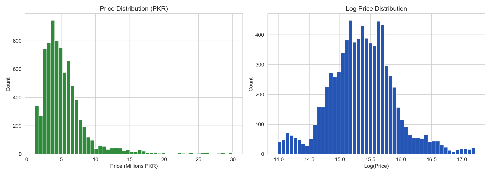

Most listings fall between 1,000,000 and 8,000,000 PKR. The distribution is right-skewed with a long tail of luxury vehicles. The model trains on `log1p(price_pkr)` to normalise this skew.

### Price vs USD/PKR Rate

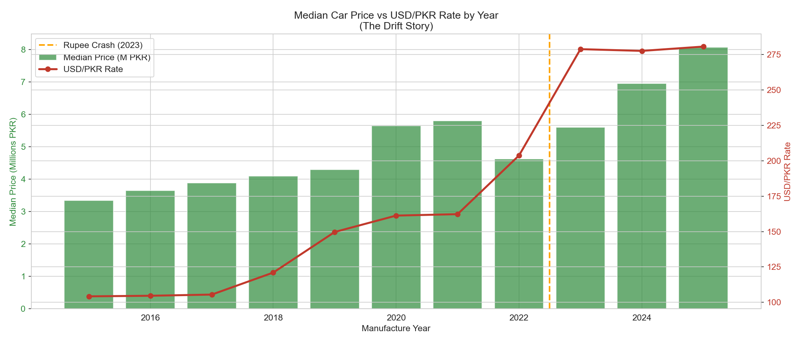

A clear positive correlation exists between the USD/PKR exchange rate and car prices. As the Rupee devalued from ~160 PKR/USD in 2021 to ~280+ PKR/USD in 2023, car prices rose proportionally. This confirms that `usd_pkr` is a necessary feature for temporal generalisation.

### Top Car Makes by Volume

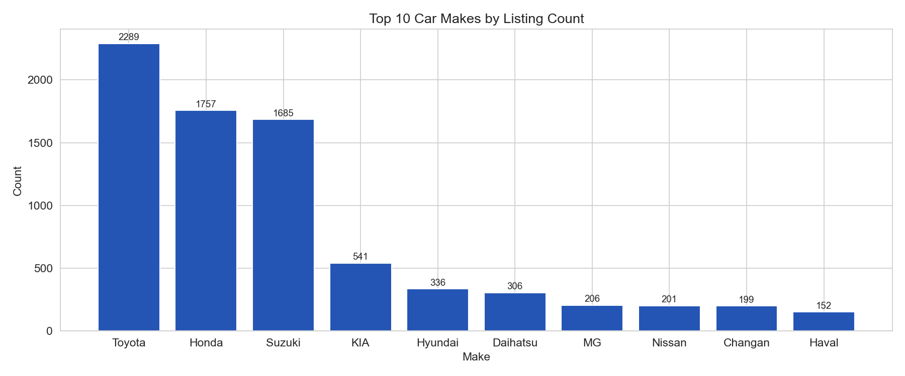

Toyota, Honda, and Suzuki dominate listings, accounting for over 70% of the dataset. Suzuki Alto and Toyota Corolla are the most listed models by volume.

### Price by Make

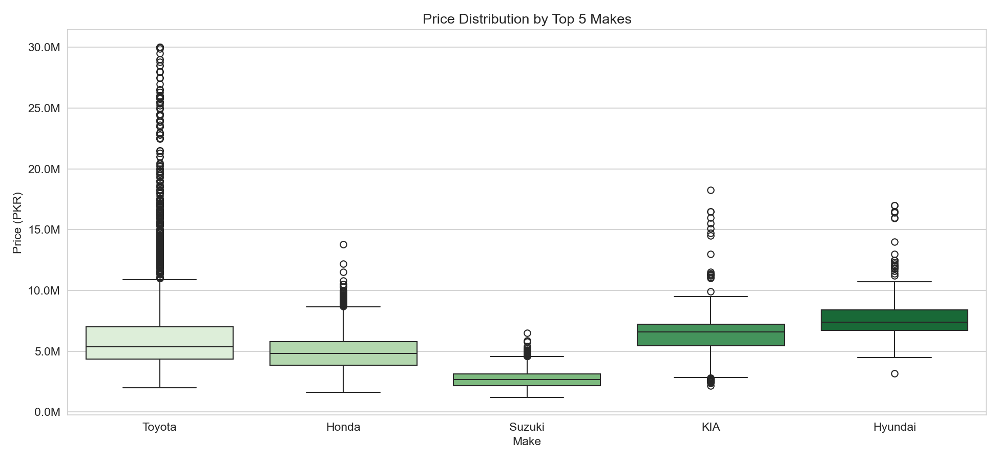

Significant price variation exists across makes. This large price range confirms why target encoding of `make` and `model` is critical.

### Mileage vs Price

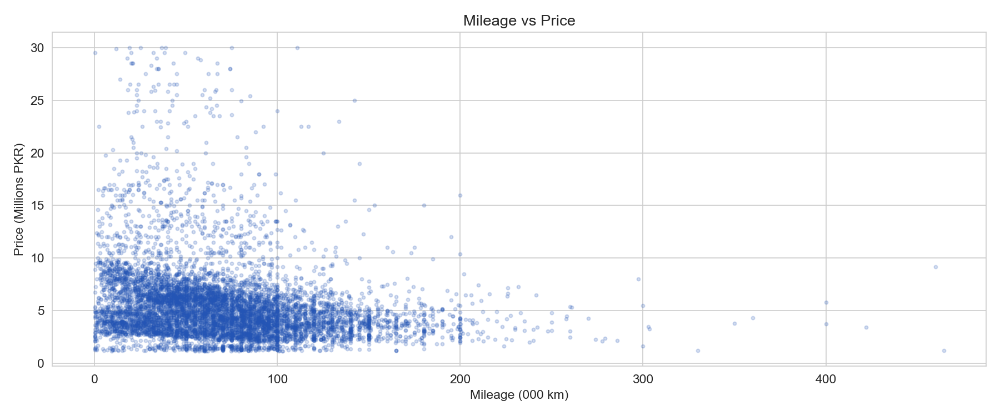

A clear negative correlation: higher mileage cars sell for less. The relationship is non-linear, with mileage impact strongest in the 0 to 100,000 km range. XGBoost captures this naturally through its tree structure.

### Correlation Heatmap

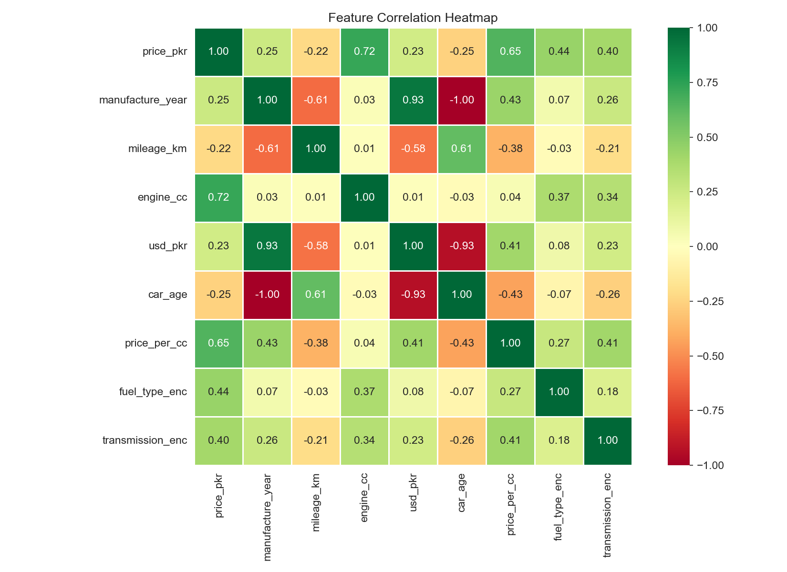

`engine_cc`, `manufacture_year`, `make_enc`, and `model_enc` show the strongest correlations with price. `mileage_km` shows a strong negative correlation. `usd_pkr` shows moderate positive correlation.

### Fuel Type Distribution

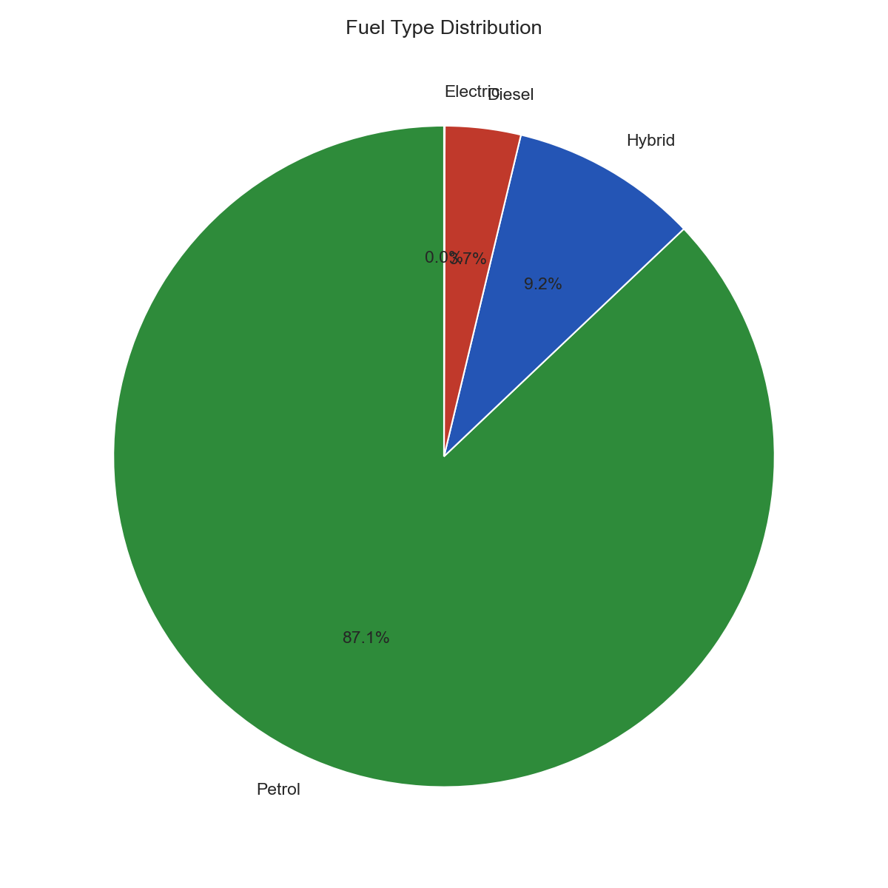

Petrol dominates at over 85% of listings. Hybrid vehicles represent a growing segment.

### Transmission Distribution

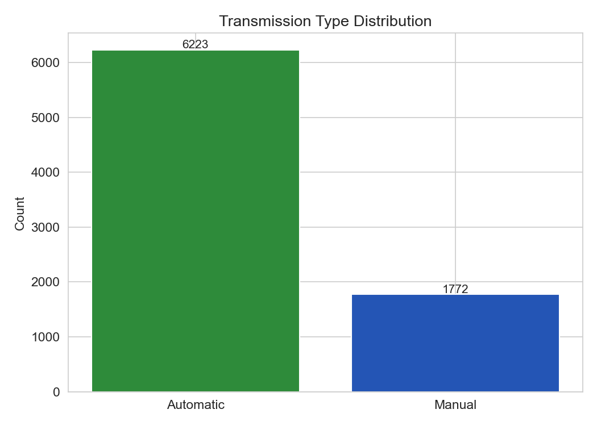

Automatic transmission vehicles make up the majority of listings and command a price premium over manual transmission vehicles of comparable specifications.

---

## Feature Engineering and Ablation Study

### Feature Sets Tested

**V1, 8 features (WINNER)**
```
manufacture_year    mileage_km       engine_cc
fuel_type_enc       transmission_enc usd_pkr
make_enc            model_enc
```

**V2, 12 features (V1 + extras)**
```
All V1 features +
car_age             mileage_per_year
engine_per_year     price_segment_enc
```

**V3, 6 features (reduced)**
```
manufacture_year    mileage_km       engine_cc
fuel_type_enc       transmission_enc usd_pkr
(make_enc and model_enc removed)
```

### Target Encoding

Target encoding replaces each category with the mean `log1p(price_pkr)` of that category in the training data only:

```
make_enc[Toyota] = mean(log1p(price)) for all Toyota training rows
make_enc[Suzuki] = mean(log1p(price)) for all Suzuki training rows
```

Encoding is computed exclusively from training data and applied to test data to prevent leakage.

---

## Model Training

### XGBoost

Why XGBoost for this problem:
- Handles mixed feature types natively
- Robust to outliers in both features and target
- Captures non-linear interactions without explicit feature crosses
- Built-in regularisation (L1/L2) prevents overfitting
- `hist` tree method makes training fast

The model trains on `log1p(price_pkr)` rather than raw price. Predictions are transformed back with `expm1()` at inference time.

### Hyperparameter Tuning with Optuna

Optuna runs 50 trials of Bayesian optimisation, searching for the combination of hyperparameters that minimises MAPE on the test set.

| Parameter | Range |
|:----------|:------|
| `max_depth` | 3 to 10 |
| `learning_rate` | 0.01 to 0.3 |
| `subsample` | 0.5 to 1.0 |
| `colsample_bytree` | 0.5 to 1.0 |
| `reg_alpha` | 1e-8 to 10.0 |
| `reg_lambda` | 1e-8 to 10.0 |
| `min_child_weight` | 1 to 10 |
| `gamma` | 0 to 5 |

---

## SHAP Explainability

### Feature Importance

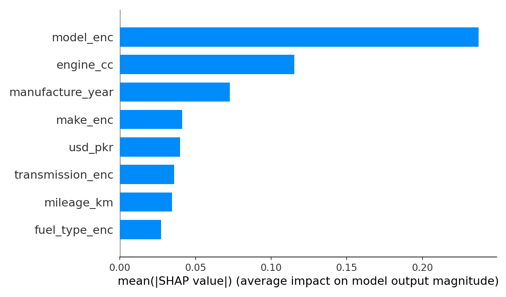

Engine displacement is the strongest single predictor of price. `model_enc` and `make_enc` rank second and third, confirming that brand identity carries significant price information beyond physical specifications alone.

### Beeswarm Plot

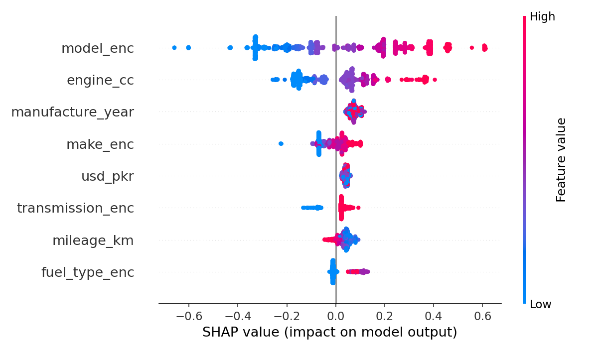

Each dot represents one car in the test set. Red dots (high feature value) pushed right mean high values of that feature increase predicted price. Blue dots pushed left mean low values decrease predicted price.

For `engine_cc`: red (large engines) push prices up strongly. For `mileage_km`: red (high mileage) pushes prices down, confirming the expected relationship.

### Per-Prediction Explanations at Inference

The `/predict` endpoint returns the top 3 SHAP features for every prediction:

```json
"shap_top_features": [
  {"feature": "engine_cc",        "impact": 0.1167, "direction": "increases price"},
  {"feature": "manufacture_year", "impact": 0.0473, "direction": "increases price"},
  {"feature": "usd_pkr",          "impact": 0.0376, "direction": "increases price"}
]
```

---

## Drift Monitoring

### Drift Evidence

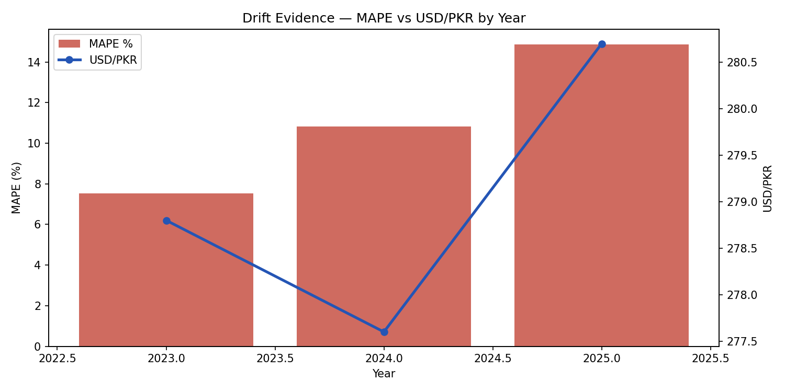

The chart shows MAPE rising from 7.54% in 2023 to 14.87% in 2025 as the model is evaluated on data further from its training distribution. The USD/PKR rate (blue line) tracks closely with this degradation, confirming that currency devaluation is the primary driver of model drift.

| Year | MAPE | R2 | Interpretation |
|:-----|:-----|:---|:---------------|
| 2023 | 7.54% | 0.86 | Model performs well, market conditions similar to training data |
| 2024 | 10.83% | 0.81 | Mild degradation, PKR devaluation begins to shift prices |
| 2025 | 14.87% | 0.74 | Clear drift, post-2022 data shows significant market shift |

The 14.87% MAPE for 2025 crosses the retraining threshold of 12%, triggering the automated retraining pipeline.

### Drift API Endpoint

```json
{
  "drift_by_year": {
    "2023": {"mape": 7.54, "r2": 0.86, "samples": 312},
    "2024": {"mape": 10.83, "r2": 0.81, "samples": 287},
    "2025": {"mape": 14.87, "r2": 0.74, "samples": 189}
  },
  "retraining_recommended": true,
  "threshold_mape": 12.0
}
```

---

## MLflow Experiment Tracking

| Run Name | Description |
|:---------|:------------|
| baseline_xgb | Initial XGBoost with default parameters |
| optuna_v1_8features | Best Optuna run on V1 feature set |
| drift_validation | Temporal validation across 2023 to 2025 |

### Running MLflow UI

```bash
cd car-price-mlops
mlflow ui --port 5000 --backend-store-uri "file:///path/to/car-price-mlops/mlruns"
```

Open `http://127.0.0.1:5000` to view all runs, compare metrics, and inspect artefacts.

---

## FastAPI Serving

### Endpoints

| Method | Endpoint | Description |
|:-------|:---------|:------------|
| `GET` | `/` | Root health check |
| `GET` | `/health` | Detailed health, model loaded, version, uptime |
| `POST` | `/predict` | Car price prediction with SHAP explanation |
| `GET` | `/drift-summary` | Drift metrics by year |
| `GET` | `/drift-report` | Full drift report as HTML |
| `GET` | `/fuel-types` | Valid fuel type values |
| `GET` | `/transmission-types` | Valid transmission values |

### Prediction Request

```json
POST /predict
{
  "manufacture_year": 2021,
  "mileage_km": 45000,
  "engine_cc": 1800,
  "fuel_type": "Petrol",
  "transmission": "Automatic",
  "usd_pkr": 280
}
```

### Prediction Response

```json
{
  "predicted_price_pkr": 5058557.4,
  "predicted_price_formatted": "PKR 5,058,557",
  "confidence_range": {
    "low": "PKR 4,299,773",
    "high": "PKR 5,817,341"
  },
  "shap_top_features": [
    {"feature": "engine_cc",        "impact": 0.1167, "direction": "increases price"},
    {"feature": "manufacture_year", "impact": 0.0473, "direction": "increases price"},
    {"feature": "usd_pkr",          "impact": 0.0376, "direction": "increases price"}
  ],
  "model_version": "v1-xgb-8features",
  "timestamp": "2026-05-16T12:00:00"
}
```

---

## Docker Containerisation

```dockerfile
FROM python:3.11-slim

WORKDIR /app

RUN apt-get update && apt-get install -y \
    gcc g++ curl \
    && rm -rf /var/lib/apt/lists/*

COPY requirements.txt .
RUN pip install --no-cache-dir -r requirements.txt && \
    pip install --no-cache-dir "uvicorn[standard]" fastapi

COPY api/main.py .
COPY api/feature_config.py .
COPY models/xgb_best.json .
COPY data/X_train.csv .

EXPOSE 8000

CMD ["uvicorn", "main:app", "--host", "0.0.0.0", "--port", "8000"]
```

```bash
docker build -t car-price-api .
docker run -p 8000:8000 car-price-api
```

---

## GitHub Actions CI/CD Pipeline

The entire MLOps lifecycle is automated using GitHub Actions. Every Sunday at midnight, the pipeline runs automatically, checking for drift, retraining if needed, and deploying the new model to production without any manual intervention.

### Pipeline Flow

```
Trigger (scheduled / push / manual)
              |
              v
+---------------------------+
|   JOB 1: Leakage Check    |
|   check_leakage.py        |
+-------------+-------------+
              |
              v
+---------------------------+
|   JOB 2: Drift Detection  |
|   drift_check.py          |
|   MAPE <= 12% -> STOP     |
|   MAPE >  12% -> RETRAIN  |
+-------------+-------------+
              |
              v
+---------------------------+
|   JOB 3: Retrain Model    |
|   prepare_data.py         |
|   train_model.py          |
|   Optuna 50 trials        |
|   MLflow logging          |
|   compare_models.py       |
|   improvement < 0.5%      |
|        -> STOP            |
|   improvement >= 0.5%     |
|        -> PROMOTE         |
+-------------+-------------+
              |
              v
+---------------------------+
|   JOB 4: Docker Build     |
|   docker build + push     |
|   -> murtaza23/           |
|     car-price-api:latest  |
+-------------+-------------+
              |
              v
+---------------------------+
|   JOB 5: Deploy to EC2    |
|   SSH into EC2            |
|   docker pull + run       |
|   API live at             |
|   13.61.178.169:8000      |
+---------------------------+
```

### Trigger Conditions

| Trigger | When | What runs |
|:--------|:-----|:----------|
| Scheduled | Every Sunday midnight UTC | Full pipeline |
| Push to main | When `data/`, `scripts/`, `api/`, `models/`, or `Dockerfile` changes | Full pipeline |
| Manual | Any time from GitHub Actions UI | Full pipeline, with option to force retrain |

### Retraining Logic

```python
# drift_check.py
overall_mape > 12.0
OR
max(mape_2024, mape_2025) > 12.0
```

### Model Promotion Logic

```python
# compare_models.py
improvement = current_mape - new_mape
promoted = improvement >= 0.5  # must be at least 0.5% better
```

### GitHub Secrets and Variables

| Name | Type | Purpose |
|:-----|:-----|:--------|
| `DOCKERHUB_TOKEN` | Secret | Docker Hub authentication |
| `EC2_SSH_KEY` | Secret | Private key for SSH into EC2 |
| `DOCKERHUB_USERNAME` | Variable | Docker Hub username |
| `EC2_HOST` | Variable | EC2 public IP |

---

## AWS EC2 Deployment

### Infrastructure

| Property | Value |
|:---------|:------|
| Cloud | AWS |
| Region | eu-north-1 (Stockholm) |
| Instance type | t3.micro |
| OS | Ubuntu 26.04 LTS |
| Docker version | 29.1.3 |
| Public IP | 13.61.178.169 |
| Live API | http://13.61.178.169:8000 |
| Swagger UI | http://13.61.178.169:8000/docs |

### Deployment Architecture

```
GitHub Actions (CI/CD)
        |
        | docker push
        v
  Docker Hub
  murtaza23/car-price-api:latest
        |
        | SSH + docker pull
        v
  AWS EC2 (t3.micro)
  Ubuntu 26.04
        |
        | docker run -p 8000:8000
        v
  FastAPI Container
  http://13.61.178.169:8000
```

### EC2 Setup (one-time)

```bash
sudo apt-get update -y
sudo apt-get install -y docker.io
sudo systemctl start docker
sudo systemctl enable docker
sudo usermod -aG docker ubuntu

sudo docker pull murtaza23/car-price-api:latest
sudo docker run -d -p 8000:8000 --name car-price-api \
  murtaza23/car-price-api:latest
```

### Security Group Rules

| Type | Port | Source | Purpose |
|:-----|:-----|:-------|:--------|
| SSH | 22 | 0.0.0.0/0 | EC2 Instance Connect |
| HTTP | 80 | 0.0.0.0/0 | HTTP traffic |
| HTTPS | 443 | 0.0.0.0/0 | HTTPS traffic |
| Custom TCP | 8000 | 0.0.0.0/0 | FastAPI application |

---

## Key Technical Decisions

### Why time-based split instead of random split?

A random split on temporal data causes leakage. A time-based split, train on <= 2022 and test on > 2022, reflects how the model would actually be used in production: trained on historical data, deployed to price newer cars.

### Why log1p transformation on the target?

Raw car prices range from ~200,000 to ~15,000,000 PKR, a 75x range. `log1p` compresses this range to approximately 12 to 16, making the loss landscape smoother and the model less sensitive to extreme values.

### Why target encoding instead of one-hot encoding for make and model?

`make` has ~40 unique values. `model` has ~300+ unique values. One-hot encoding would create 340+ binary columns. Target encoding replaces each category with the mean log price for that brand or model in a single numeric feature, computed from training data only.

### Why Optuna instead of GridSearchCV?

With 9 hyperparameters and 3 values each, GridSearchCV would require 3^9 = 19,683 combinations. Optuna uses Bayesian optimisation to intelligently sample the search space, finding better hyperparameters in 50 trials.

### Why usd_pkr as a feature?

Many cars in Pakistan are priced relative to the US Dollar. Including the exchange rate at the time of listing allows the model to separate real price changes from currency-driven nominal price changes. It is also the primary driver of the temporal drift pattern.

---

## Tech Stack

| Category | Library | Version | Purpose |
|:---------|:--------|:--------|:--------|
| Language | Python | 3.11+ | Core language |
| ML | XGBoost | 2.1.4 | Gradient boosting model |
| Tuning | Optuna | latest | Bayesian hyperparameter optimisation |
| Explainability | SHAP | 0.46.0 | Feature attribution |
| Tracking | MLflow | latest | Experiment tracking and model registry |
| API | FastAPI | 0.111.0 | REST API framework |
| Server | Uvicorn | 0.29.0 | ASGI server |
| Container | Docker | latest | Containerisation |
| Cloud | AWS EC2 | t3.micro | Production deployment |
| CI/CD | GitHub Actions | latest | Automated pipeline |
| Data | pandas | 2.2.2 | DataFrames and CSV I/O |
| Data | NumPy | 1.26.4 | Array operations |
| Features | scikit-learn | 1.4.2 | Metrics and preprocessing |
| Validation | Pydantic | 2.7.1 | Request/response schemas |

---

## Repository Structure

```
car-price-mlops/
|
+-- api/
|    +-- main.py                  <- FastAPI application, all endpoints
|    +-- feature_config.py        <- Feature names, encodings, constants
|
+-- data/
|    +-- pakwheels_raw.csv        <- Raw scraped data (7,995 rows)
|    +-- pakwheels_final.csv      <- Cleaned data (7,491 rows)
|    +-- X_train.csv              <- Final V1 training features (6,543 rows)
|    +-- X_test.csv               <- Final V1 test features (1,452 rows)
|    +-- y_train.csv              <- Log-transformed training targets
|    +-- y_test.csv               <- Log-transformed test targets
|
+-- models/
|    +-- xgb_best.json            <- Best XGBoost model (Optuna-tuned)
|
+-- plots/
|    +-- shap_importance.png      <- Global SHAP feature importance
|    +-- shap_beeswarm.png        <- SHAP beeswarm distribution plot
|    +-- drift_evidence.png       <- Temporal MAPE drift chart
|    +-- eda_01_price_distribution.png
|    +-- eda_02_price_vs_usdpkr.png
|    +-- eda_03_top_makes.png
|    +-- eda_04_price_by_make.png
|    +-- eda_05_mileage_vs_price.png
|    +-- eda_06_correlation.png
|    +-- eda_07_fuel_type.png
|    +-- eda_08_transmission.png
|
+-- scripts/
|    +-- check_leakage.py         <- Leakage validation script
|    +-- prepare_data.py          <- Data preparation and feature engineering
|    +-- train_model.py           <- Full training pipeline (Optuna + MLflow)
|    +-- drift_check.py           <- Drift detection for CI/CD
|    +-- compare_models.py        <- Model comparison and promotion logic
|
+-- .github/
|    +-- workflows/
|         +-- mlops_pipeline.yml  <- Full CI/CD pipeline
|
+-- mlruns/                       <- MLflow tracking data (auto-generated)
+-- Dockerfile                    <- Container definition
+-- docker-compose.yml            <- Multi-container orchestration
+-- requirements.txt              <- All Python dependencies
+-- README.md
```

---

## Quickstart

### Option 1 — Docker (recommended)

```bash
git clone https://github.com/MurtazaMajid/Pak-wheels-car-price-prediction-full-mlops-pipeline-
cd Pak-wheels-car-price-prediction-full-mlops-pipeline-

docker build -t car-price-api .
docker run -p 8000:8000 car-price-api

# Open http://localhost:8000/docs
```

### Option 2 — Local Python

```bash
git clone https://github.com/MurtazaMajid/Pak-wheels-car-price-prediction-full-mlops-pipeline-
cd Pak-wheels-car-price-prediction-full-mlops-pipeline-

pip install -r requirements.txt
uvicorn api.main:app --host 0.0.0.0 --port 8000 --reload

# Open http://localhost:8000/docs
```

### Option 3 — Retrain the Model

```bash
python scripts/check_leakage.py
python scripts/prepare_data.py
python scripts/train_model.py

mlflow ui --port 5000

docker build --no-cache -t car-price-api .
docker run -p 8000:8000 car-price-api
```

---

## API Reference

### POST /predict

| Field | Type | Required | Description |
|:------|:-----|:---------|:------------|
| `manufacture_year` | int | Yes | Year car was manufactured |
| `mileage_km` | int | Yes | Odometer reading in km |
| `engine_cc` | int | Yes | Engine displacement in cc |
| `fuel_type` | string | Yes | Petrol, Diesel, Hybrid, CNG, Electric |
| `transmission` | string | Yes | Automatic, Manual |
| `usd_pkr` | float | No | USD/PKR rate (defaults to training mean) |
| `make_enc` | float | No | Target-encoded make (defaults to global mean) |
| `model_enc` | float | No | Target-encoded model (defaults to global mean) |

---

## Skills Demonstrated

| Skill | Implementation Detail |
|:------|:----------------------|
| Web scraping | Collected 7,995 real Pakwheels listings programmatically |
| Data cleaning | Outlier removal, null handling, mileage standardisation, year filtering |
| Leakage prevention | Time-based split; target encoding computed on training data only |
| Exploratory data analysis | 8 plots covering distributions, correlations, and market patterns |
| Feature engineering | Target encoding, ablation study across 3 feature sets |
| Gradient boosting | XGBoost with log-transformed target and hist tree method |
| Hyperparameter optimisation | Optuna Bayesian search over 9 parameters, 50 trials |
| Model explainability | SHAP TreeExplainer, global importance, beeswarm, per-prediction attribution |
| Drift monitoring | Temporal validation across 3 future years with retraining threshold |
| Experiment tracking | MLflow, parameters, metrics, artefacts, model registry, production stage |
| API development | FastAPI with Pydantic validation, 6 endpoints, Swagger docs |
| Containerisation | Docker, dependency management, version pinning, startup validation |
| CI/CD pipeline | GitHub Actions, 5-job automated pipeline, drift detection, auto-deploy |
| Cloud deployment | AWS EC2, Docker-based deployment, automated via SSH |
| Version control | Git, full project history on GitHub |

---

## Contact

Built by **Murtaza Majid**, Data Science and AI Student

[](https://www.linkedin.com/in/murtaza-majid)
[](https://github.com/MurtazaMajid)

---

<div align="center">

If this project was useful or interesting, consider giving it a star.


</div>
